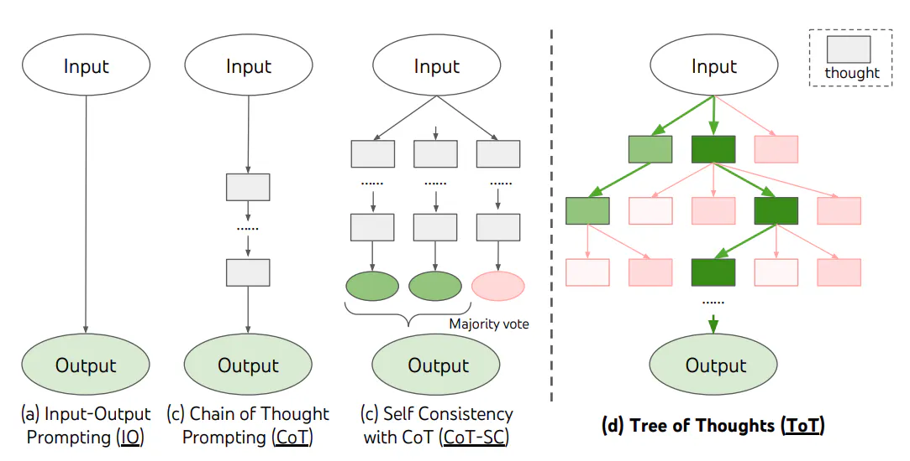
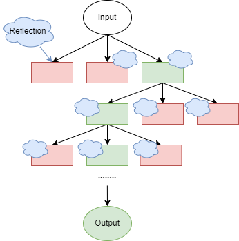

# Converting an AWS Lambda into an Azure Function using LLMs in Go

As part of a migration I was given the task to convert a big number of AWS Lambdas into Azure Functions, and my boss had a great idea, let's try to do it using LLMs and Chat-GPT.

So I went for it, but what would it take to convert a Lambda Function into an Azure Function?

There are a few things we need to take into account with Lambda Functions:

1. Lambda functions don't use bindings, so we won't use the binding format for inputs or the outputs.

2. Input bindings in the entrypoint are received in the entry handler as a json format object.

3. As output bindings don't exist, all output in Lambdas are handled by using the AWS SDKs.

So what do we need to do the conversion? We can separate the process in these steps:

1. Converting the entrypoint to Azure Function format.
2. Converting any libraries using the AWS SDKs to use an interface instead that can connect either to AWS or Azure. Why? well if we are doing a migration, we may want to keep using the AWS services until the data or queues are fully migrated.
3. Finally we'll need our Azure Function configuration files, like host.json, local.settings.json, and function.json, to be able to run our function. We'll need to generate this files by adding some info that the lambda is not giving us like if the input bindings are for an http input or a queue.

Let's talk about the first step, let's start by looking at a Lambda.

## How does a Lambda look like?

A basic Lambda Function in go looks like this:

```go
package main

import (
	"context"
	"fmt"

	"github.com/aws/aws-lambda-go/lambda"
)

type MyEvent struct {
	Name string `json:"name"`
}

type MyResponse struct {
	Message string `json:"message"`
}

func HandleRequest(ctx context.Context, event *MyEvent) (*MyResponse, error) {
	if event == nil {
		return nil, fmt.Errorf("received nil event")
	}
	message := fmt.Sprintf("Hello %s!", event.Name)
	return &MyResponse{Message: message}, nil
}

func main() {
	lambda.Start(HandleRequest)
}
```

In this example we are showing a simple hello world Lambda we can see here it includes some interesting features like:

- A package `github.com/aws/aws-lambda-go/lambda`
- A main function starting the lambda by calling `lambda.Start(HandleRequest)`
- A handler referenced in the main function with this signature: `HandleRequest(ctx context.Context, event *MyEvent) (*MyResponse, error)`

An interesting thing on Lambda functions is that the handler can have different signatures, for example all of these signatures are valid:

```go
func ()
func () error
func (TIn) error
func () (TOut, error)
func (context.Context) error
func (context.Context, TIn) error
func (context.Context) (TOut, error)
func (context.Context, TIn) (TOut, error)
```

Where TIn and TOut represent types compatible with the encoding/json standard library.

So we need to convert this entrypoint to an Azure Function Format.

## What should be the result?

We have Go Lambdas and we want to convert them to Go Azure Functions. Azure Functions, as of today, doesn't have a language-specific handler fo Go, so, we need to use a custom handler to do the conversion instead.

Custom handlers are lightweight web servers that receive events from the Functions host. The only thing we need is to implement an HTTP server.

Personally I like the Gin Web Framework so let's do an example using it. This would be, more or less, the code we would like to get after the conversion:

```go
package main

import (
	"fmt"
	"net/http"

	"github.com/gin-gonic/gin"
)

type MyEvent struct {
	Name string `json:"name"`
}

type MyResponse struct {
	Message string `json:"message"`
}

func HandleRequest(ctx *gin.Context) {
	if ctx.Request.Body == nil {
		errorMsg := "received nil event"
		ctx.JSON(http.StatusBadRequest, gin.H{"error": errorMsg})
		return 
	}

	var event MyEvent
	err := ctx.ShouldBindJSON(&event)
	if err != nil {
		errorMsg := fmt.Sprintf("error on reading request body: %v\n", err.Error())
		ctx.JSON(http.StatusBadRequest, gin.H{"error": errorMsg})
		return
	}

	message := fmt.Sprintf("Hello %s!", event.Name)
	ctx.JSON(http.StatusOK, &MyResponse{Message: message})
}

func main() {
	r := gin.Default()
	r.Handle(http.MethodPost, "/HandleRequest", HandleRequest)

	r.Run()
}
```

We can see here we are keeping the original structs for the request and the response exactly the same, and that we still have a function handler but with a slightly different signature `func HandleRequest(ctx *gin.Context)` to be able to use the gin context instead. We are keeping the nil validation from the original but we need to parse the object ourselves. Finally the main function now is initializing a gin http server instead of a lambda. 

It looks pretty good to me :)

So now how do we teach an LLM to do this conversion?

## The attempts

You've probably have heard by now about Prompt Engineering, Prompt engineering is the process to write the best instructions possible to the LLMs so we are able to get the result we are looking for. It includes several techniques, and we are going to need some of these techniques to be able to do the conversion. There's a really nice guide for some of these techniques [here](https://www.promptingguide.ai/).

There are a few techniques using prompt engineering that didn't work for me, as I got a lot of hallucinations and wrong code, but were nice tries so let's just list them here.

### Chain-of-Thought (CoT) Prompt

This technique is about guiding the LLMs by giving them a step by step guide of the process it needs to follow, this is a very good option to help the LLMs solve mathematical equations and complex problems, but I found, that in my case the CoT was not giving me the expected results, I tried to tell the LLM how to do the conversion, but most of the times I was getting an answer telling me that the code couldn't be converted.

So it works... but for code we need more.

### Few shots using an example selector

This is a really nice technique that selects the examples using a vector database and embeddings to select the most relevant examples to do the conversion. I didn't had a big number of examples but I had enough to start testing it out. The result was unexpected, when I added just one example to the prompt I got a pretty good conversion, maybe with some issues with packages like not doing the required imports, and once even hallucinating about an azure function package that doesn't exist but with the base idea. But, when I started giving him more examples, instead of improving the model, it started returning that it wasn't able to do the conversion.

Again we needed something better.

### Fine tunning

So this is a really nice approach, not prompt engineering but instead re-training the model specifically for the task. The problem was that it requires a lot of examples of input/output pairs and I didn't had these amount of examples, also, it can be pretty expensive. So if you are trying something similar and after testing with all the Prompt Engineering options you aren't able to get the results you want, give it a try, but, be aware of the possible costs from training, deployment and queries that come with it.

This is a good option, but I wanted to find the best way to do it without having to retrain the LLM. So what did work?

## The solution

To be able to do the conversion I went looking for examples of successful work with LLMs and code. Most of the documentation you find is about LLMs and text, and there's little about code, but I was able to find this article about [Code Generation](https://paperswithcode.com/task/code-generation). In the article we can see a list of papers on how to generate code, and they were being evaluated using different Datasets. I started checking the HumanEval Dataset, And found some interesting techniques, one of them called Parsel, was all about using pseudo-code to describe what the program needs to do and after asking the LLM to convert it into real code, That one sounded interesting but the one that caught my attention, was the [Language Agent Tree Search](https://paperswithcode.com/paper/language-agent-tree-search-unifies-reasoning) using GPT-4, it was the one that scored the best in the Dataset and with a 94.4% of passing rate sounded really promising.

So what is "Language Agent Tree Search" about? [Here](https://andyz245.github.io/LanguageAgentTreeSearch/) you can find a nice explanation about it but we can summarize it as combining two Prompt Engineering techniques, Tree of thoughts and ReAct, in order to get the best results. 

Tree of Thoughts as stated [here](https://www.promptingguide.ai/techniques/tot) is *a framework that generalizes over chain-of-thought prompting and encourages exploration over thoughts that serve as intermediate step for general problem solving with language models*. The idea behind Tree of Thoughts is to search for a solution through a tree of partial solutions discarding the ones that don't show any future like is shown in the image.


*Tree of thoughts, image source: https://www.promptingguide.ai/techniques/tot*

ReAct on the other hand, as stated [here](https://www.promptingguide.ai/techniques/react) attempts to *reasoning traces and task-specific actions in an interleaved manner*. The idea is to generate reasoning traces based on the execution of the model and that way learn from its mistakes.

Combining both prompt engineering strategies we get something like this:



*Language agent tree search*

Having a tree of thoughts combined with ReAct, allows us to iterate over a problem, but giving the LLMs feedback about what it did wrong, and then, act again using the self-reflection as an input find a better solution.

So, I created an implementation for the lambda-azure converter based on the code from the lats implementation found [here](https://github.com/andyz245/LanguageAgentTreeSearch)

Let's see it in action.

### Simple prompt

Let's feed our app the initial example Lambda code we wrote.

I'll be using for this project the GPT-4 model, as is the one that gave the best results in the paper, but you can try the same process using the LLMs available to you.

We need to start with a first attempt to the problem using a simple prompt here's the one that I've been using:

```
You are an AI that only responds with Go code, NOT ENGLISH. You will be given a lambda function code. Rewrite the code without using lambda code and using a GinGonic server instead.
```

And here's the result: 

```go
package main

import (
	"fmt"
	"net/http"

	"github.com/gin-gonic/gin"
)

type MyEvent struct {
	Name string `json:"name"`
}

type MyResponse struct {
	Message string `json:"message"`
}

func HandleRequest(c *gin.Context) {
	var event MyEvent
	if err := c.ShouldBindJSON(&event); err != nil {
		c.JSON(http.StatusBadRequest, gin.H{"error": err.Error()})
		return
	}

	message := fmt.Sprintf("Hello %s!", event.Name)
	c.JSON(http.StatusOK, MyResponse{Message: message})
}

func main() {
	router := gin.Default()
	router.POST("/handle-request", HandleRequest)
	router.Run() // By default, it listens on :8080
}
```

This is a nice first attempt, we also want to check that the code it generated is working, so let's ask the LLM to generate some tests for us.

```
You are a Go programming assistant, an AI coding assistant that can write unique, diverse, and intuitive unit tests for functions. You will be given a Go AWS Lambda function, that is being converted to a GinGonic http server. Your job is to generate a comprehensive set of tests to ensure its functionality remains consistent. The tests should cover all major functionality of the function, including error handling, input validation, and expected output.

Here is the Go code for the AWS Lambda function: 
{{lambdaCode}}

Here is the Go code for the GinGonic http server:
{{azureCode}}
```

Here's the generated tests:

```go
package main

import (
	"bytes"
	"net/http"
	"net/http/httptest"
	"testing"

	"github.com/gin-gonic/gin"
	"github.com/stretchr/testify/assert"
)

func setupRouter() *gin.Engine {
	gin.SetMode(gin.TestMode)
	r := gin.Default()
	r.POST("/event", HandleRequest)
	return r
}

func TestHandleRequest_Successful(t *testing.T) {
	router := setupRouter()

	w := httptest.NewRecorder()
	body := bytes.NewBufferString(`{"name":"John Doe"}`)
	req, _ := http.NewRequest("POST", "/event", body)
	req.Header.Set("Content-Type", "application/json")

	router.ServeHTTP(w, req)

	assert.Equal(t, http.StatusOK, w.Code)
	assert.JSONEq(t, `{"message":"Hello John Doe!"}`, w.Body.String())
}

func TestHandleRequest_BadRequest(t *testing.T) {
	router := setupRouter()

	w := httptest.NewRecorder()
	body := bytes.NewBufferString(`{"nom":"John Doe"}`) // Incorrect JSON field name
	req, _ := http.NewRequest("POST", "/event", body)
	req.Header.Set("Content-Type", "application/json")

	router.ServeHTTP(w, req)

	assert.Equal(t, http.StatusBadRequest, w.Code)
}

func TestHandleRequest_EmptyBody(t *testing.T) {
	router := setupRouter()

	w := httptest.NewRecorder()
	body := bytes.NewBufferString(`{}`) // Empty JSON body
	req, _ := http.NewRequest("POST", "/event", body)
	req.Header.Set("Content-Type", "application/json")

	router.ServeHTTP(w, req)

	assert.Equal(t, http.StatusOK, w.Code)
	assert.JSONEq(t, `{"message":"Hello !"}`, w.Body.String()) // Expect default behavior for empty name
}
```

Really nice!, the LLM is testing a success escenario a bad request and an empty input, these are going to be of help to check everything is working properly.

So how can we know if the code works? and that the tests pass? well we need to build the code and check that we don't have any compile errors, or failed tests. In addition we can add our own tests if we have them available, I'm adding this one.

```go
package main

import (
	"net/http"
	"net/http/httptest"
	"strings"
	"testing"

	"github.com/gin-gonic/gin"
	"github.com/stretchr/testify/assert"
)

func TestHandleRequest(t *testing.T) {
	type args struct {
		request *http.Request
	}
	tests := []struct {
		name         string
		request      func() *http.Request
		expectedCode int
		expectedBody string
	}{
		{
			name: "success",
			request: func() *http.Request {
				req := `{"name":"Ana"}`
				return httptest.NewRequest(http.MethodPost, "/handle", strings.NewReader(req))
			},
			expectedCode: http.StatusOK,
			expectedBody: `{"message":"Hello Ana!"}`,
		},
	}
	for _, tt := range tests {
		t.Run(tt.name, func(t *testing.T) {
			router := gin.Default()
			router.POST("/handle", HandleRequest)

			w := httptest.NewRecorder()
			httpHandler := router
			httpHandler.ServeHTTP(w, tt.request())

			assert.Equal(t, tt.expectedCode, w.Code)
			assert.Equal(t, tt.expectedBody, w.Body.String())
		})
	}
}
```

Using go and some methods to execute commands I compiled the code and ran the tests programmatically, in addition I designed a score system where a successful build gives 2 points and each successful test gives 1 point, I divide everything over the max available points and based on this score I can define if the code is correct.

Here are the results:

```yaml
IsPassing: false 
Feedback: |
	TestsPassed: ... <The code for the test I manually added>
	TestsFailed: ... <The code for the auto-generated one>		
	ErrorTrace: 
		C:/Users/XXXXX/AppData/Local/Temp/go-lats/lats_test.go:44
		Error:      	Not equal: 
						expected: 400
						actual  : 200
		Test:       	TestHandleRequest_BadRequest
Score: 0.75
```

We can see here that the test I gave him passed, but the test he came up with failed, because the function is not handling the case when the input is wrong. 

As we were not able to get a solution in the first attempt the next step is to create a tree of children solutions using self-reflection and then use the one that gives us the best score. But of course if one of this attempts is a solution we'll stop the iteration and return it as a solution.

So based on this Feedback let's ask the LLM to generate a self-reflection:

```
You are a Go programming assistant. You will be given a function implementation and a series of unit tests. Your goal is to write a few sentences to explain why your implementation is wrong as indicated by the tests. You will need this as a hint when you try again later. Only provide the few sentence description in your answer, not the implementation.

{{examples}}

[function impl]:
{{azure_code}}

[unit test results]:
{{feedback}}

[self-reflection]:"
```

This was the response from the LLM:

```
The function implementation seems to assume that if the JSON binding fails due to a bad request (such as wrong field names), the error should be reported with a status code of `http.StatusBadRequest`. However, the failing unit test `TestHandleRequest_BadRequest` suggests that this behavior is not occurring as expected. The test sends a JSON body with an incorrect field name (`"nom"` instead of `"name"`) and expects a `http.StatusBadRequest` status code due to binding failure, but the test reports receiving a `http.StatusOK` status code instead. This indicates that the `ShouldBindJSON` method might not be detecting the discrepancy between the expected and received JSON fields or the error handling logic after the `ShouldBindJSON` call is not functioning correctly.
```

Ok now we have everything we need to try again, so let's ask the LLM to generate the code and tests again:

```
[system message]:
You are an AI Go assistant. You will be given your past function implementation, a series of unit tests, and a hint to change the implementation appropriately. Write your full implementation, Rewrite the code without using lambda code and using a GinGonic server instead. Do not by any chance use lambda code.
Use a Go code block to write your response. For example:
```go
func main() {
    fmt.Println("Hello, World!")
}

{{examples}}

[user message]:
{{lambda_code}}

[assistant message]:
{{azure_code}}

[user message]:
[unit test results from previous impl]:
{{feedback}}

[assistant message]:
[reflection on previous impl]:
{{self-reflection}}

[user message]:
Try to convert this code again:
{{lambda_code}}
```

And this is the resulting new code:

```go
package main

import (
	"fmt"
	"net/http"

	"github.com/gin-gonic/gin"
)

type MyEvent struct {
	Name string `json:"name"`
}

type MyResponse struct {
	Message string `json:"message"`
}

// HandleRequest processes the event and returns a response
func HandleRequest(c *gin.Context) {
	var event MyEvent

	// Bind the JSON to the struct; if nil or incorrect, return an error.
	if err := c.ShouldBindJSON(&event); err != nil {
		c.JSON(http.StatusBadRequest, gin.H{"error": err.Error()})
		return
	}

	// Check if the event is nil or the name is an empty string
	if event.Name == "" {
		// Respond with an error message if Name is empty
		c.JSON(http.StatusBadRequest, gin.H{"error": "name field is required"})
		return
	}

	// Constructing the message
	message := fmt.Sprintf("Hello %s!", event.Name)
	response := MyResponse{Message: message}

	// Sending back the response as JSON
	c.JSON(http.StatusOK, response)
}

func main() {
	// Set up Gin router
	r := gin.Default()

	// Define POST route
	r.POST("/event", HandleRequest)

	// Run the Gin server on a specified port
	r.Run(":8080")
}
```

This implementation passes our tests and the self-generated tests, so we interrupt the process and return it as a solution, but if it didn't we will continue iterating until we get a satisfying solution, or until we reach the limit of our max defined iterations.

This method still needs to be tested against real user code, and the prompts can also use some refining, but it's a nice start.

Now after finishing the entrypoint transformation, we'll need to think about next steps, for step 2 we should be able to use a similar approach using different prompts, instead of converting the code to a Gin Web server we'll need to ask it to do a conversion that uses interface implementations instead of AWS ones, and for step 3, we could try to infer the information from the documentation, or give it to it ourselves, and with the information, ask it to create the required json files to run the Azure Function.

Hope you enjoyed this implementation approach, love to here your comments. Until the next one!